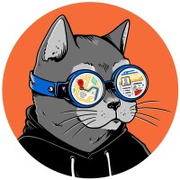
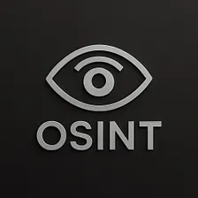
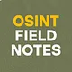
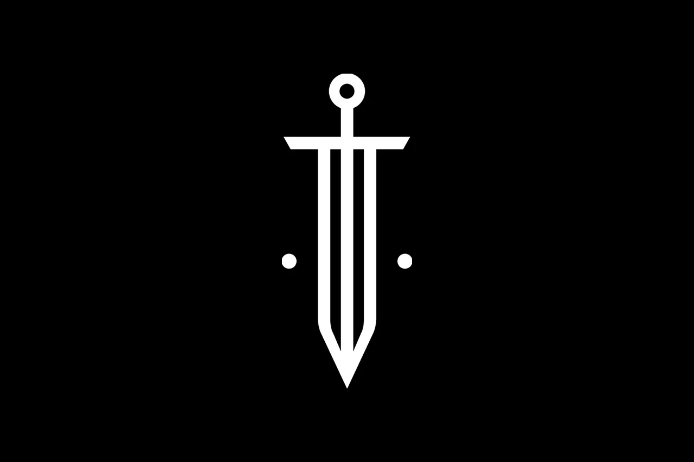
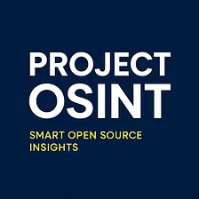
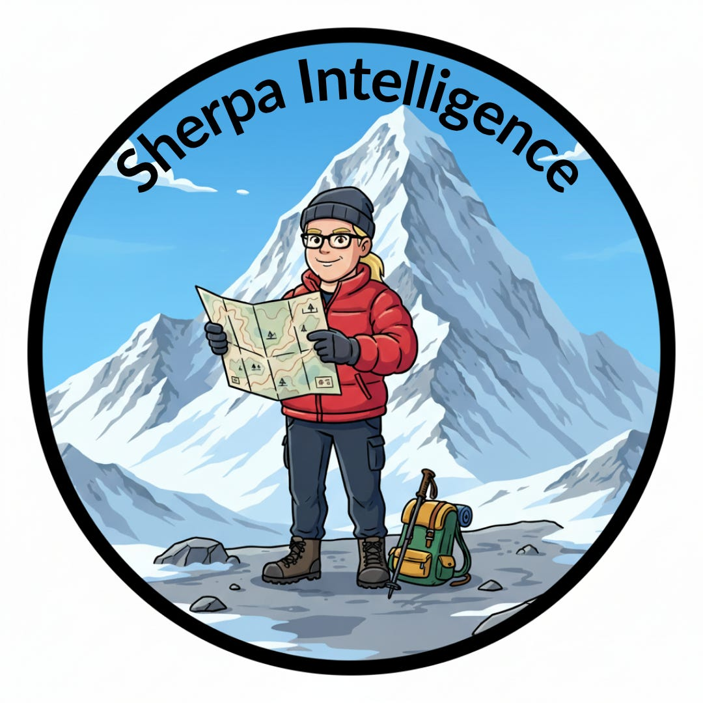

# OSINT Newsletters

In this repository, you will find a list of OSINT newsletters that will help you regularly receive information about new tools and techniques for investigations in your email inbox.

Most of them are active at the time of the repository's creation, but they also contain huge archives of publications on the topic of OSINT spanning many years.

| Logo            | Name             |     Link        | Author     |  Last activity year     |  Social Media | 
|:------------------:|------------------|-------------------------|-------------|-------------|-------------|
|  |Rae Baker: Deep Dive | https://www.raebaker.net/ | Rae Baker | 2026 | [Linkedin](https://www.linkedin.com/in/raebakerosint/) | 
|  |Indicator Media | https://indicator.media/ | Craig Silverman, Alexios Mantzarlis | 2026 | [Linkedin](https://www.linkedin.com/company/indicatormedia/) | 
|  |The OSINT Newsletter | https://osintnewsletter.com/ | Jake Creps | 2025 | [Linkedin](https://www.linkedin.com/company/the-osint-newsletter/posts/?feedView=all) | 
|  |OSINT Jobs The Weekly Newsletter | https://www.osintnewsletter.osint-jobs.com/ |  | 2025 | [Linkedin](https://www.linkedin.com/company/osint-jobs/) | 
|  |Digital Digging with Henk van Ess | https://www.digitaldigging.org/ | Henk van Ess | 2025 | [Linkedin](https://www.linkedin.com/in/searchbistro/) | 
|  |OSINTech | https://osintech.substack.com/ | Maxim Marshak | 2026 | [Linkedin](https://www.linkedin.com/in/osintech/) | 
|  |OSINT Updates | https://osintupdates.com/ | Dheeraj Yadav, Aayush Anand | 2025 | [Linkedin](https://www.linkedin.com/company/osintambition/posts/) | 
|  |OSINT Industries Newsletter | https://www.osint.industries/newsletter | Nathaniel Fried | 2026 | [Linkedin](https://www.linkedin.com/company/osint-industries/) | 
|  |OSINT Insider | https://osintinsider.com/ | Aidan Raney | 2026 | [Linkedin](https://www.linkedin.com/in/aidanosint) | 
|  |UNISHKA Research Service Newsletter | https://substack.com/@unishkaresearchservice |  | 2025 | [Linkedin](https://www.linkedin.com/company/unishka-research-service-inc/) | 
|  |OSINT Roundup - The Friday 5 Newsletter | https://www.forensicosint.com/newsletter | Ritu Gull | 2026 | [Linkedin](https://www.linkedin.com/company/forensicosint/) | 
|  |Cyber Detective | https://cybdetective.substack.com/ |  | 2025 | [Twitter](https://x.com/cyb_detective) | 
|  |The Practical OSINT by OSINT Team | https://www.osintteam.com/ | Petro Cherkasets | 2025 | [Linkedin](https://www.linkedin.com/company/osintteam/) | 
|  |The OSINT Guide | https://substack.com/@theosintguide/ | Thomas J. Caliendo | 2025 | [Linkedin](https://www.linkedin.com/in/thomas-j-caliendo/) | 
|  |Bullsh*t Hunting | https://www.bullshithunting.com/ | Justin Seitz | 2026 | [Linkedin](https://www.linkedin.com/in/seitzjustin/) | 
|  |OSINT USA | https://osintusa.substack.com/ |  | 2026 |  | 
|  |OSINT Field Notes - from Benjamin Strick | https://osintfieldnotes.substack.com/ | Benjamin Strick | 2026 | [Linkedin]() | 
|  |OSINT Community | https://osintcommunity.substack.com/ |  | 2026 | [Linkedin](https://www.linkedin.com/company/artoriastech/) | 
|  |Eurovision News Spotlight Fact-Checking & OSINT Network | https://spotlight.ebu.ch/ | Derek Bowler | 2026 | [Linkedin](https://www.linkedin.com/showcase/eurovisionnews-spotlight/) | 
|  |Project OSINT | https://substack.com/@projectosint |  | 2026 |  | 
|  | Sherpa Intelligence | https://substack.com/@sherpaintelligence | Tracy Z. Maleeff | 2026 | [Linkedin](https://www.linkedin.com/company/sherpa-intelligence/) | 
|  |BurriedSignals | https://buriedsignals.substack.com/ | Tom Vaillant | 2025 |  | 

If you are the author of an OSINT newsletter, feel free to request that it be added to this repository!

Use Issues or the contact details on the main page of Ubikron's Github profile.

## Our other repositories

[Ubikron Advanced Enrichments](https://github.com/ubikron/Advanced-Enrichments)  
[Awesome AI OSINT](https://github.com/ubikron/Awesome-AI-OSINT)  
[Awesome OSINT Chrome Extensions](https://github.com/ubikron/awesome-osint-chrome-extensions)  
[OSINT People](https://github.com/ubikron/OSINT-People)  
[OSINT Companies](https://github.com/ubikron/OSINT-Companies)  
[OSINT CTFs](https://github.com/ubikron/OSINT-CTFs)  
[OSINT Books](https://github.com/ubikron/OSINT-Books)  
[OSINT Conferences](https://github.com/ubikron/OSINT-Conferences)  

-----

Don't miss our updates!   
[Linkedin](https://www.linkedin.com/company/ubikron/)    
[YouTube](https://www.youtube.com/@ubikron)  

